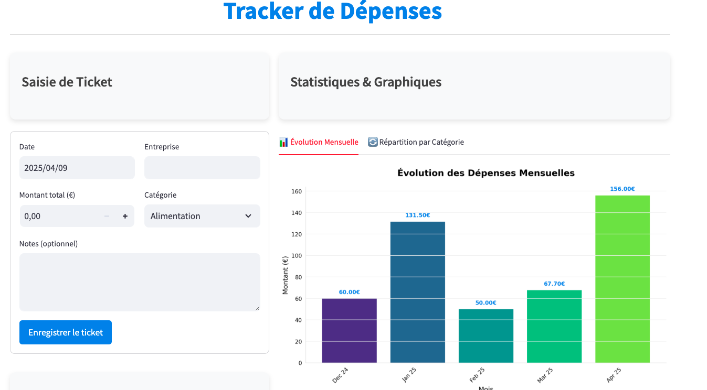
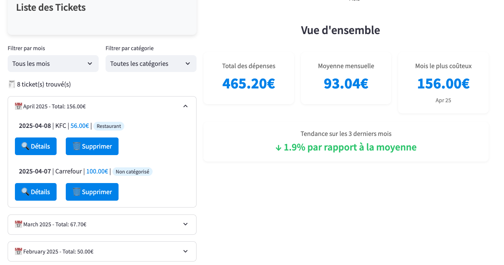

# Tracker de Dépenses

Une application web élégante et intuitive pour suivre vos dépenses personnelles, construite avec Streamlit. Cette application vous permet de gérer facilement vos tickets de dépenses et de visualiser vos habitudes de consommation à travers des graphiques interactifs.

## 



## 🌟 Fonctionnalités

- ✨ Interface utilisateur moderne et intuitive
- 📝 Saisie facile des tickets de dépenses
- 📊 Visualisations graphiques détaillées
- 📅 Suivi des dépenses mensuelles
- 🔍 Filtrage par mois et catégorie
- 📈 Statistiques détaillées
- 💾 Stockage local des données en format Markdown
- 🎨 Design responsive et élégant

## 📋 Prérequis

- Python 3.7+
- pip (gestionnaire de paquets Python)

## 🚀 Installation

1. Clonez le dépôt :

```bash
git clone https://github.com/MamadouKane/expenses-tracker.git
cd expenses-tracker
```

2. Créez un environnement virtuel (recommandé) :

```bash
python -m venv venv
source venv/bin/activate  # Sur Unix/macOS
# ou
venv\Scripts\activate  # Sur Windows
```

3. Installez les dépendances :

```bash
pip install -r requirements.txt
```

## 💻 Utilisation

1. Lancez l'application :

```bash
streamlit run expense-tracker-app.py
```

2. Ouvrez votre navigateur à l'adresse indiquée (généralement http://localhost:8501)

## 📁 Structure des données

Les tickets sont stockés dans une structure de dossiers organisée par mois :

```
receipts/
├── 2024_01/
│   ├── 2024-01-15_Carrefour.md
│   └── 2024-01-20_Amazon.md
├── 2024_02/
│   └── 2024-02-01_Leclerc.md
└── ...
```

## 🛠️ Technologies utilisées

- [Streamlit](https://streamlit.io/) - Framework web
- [Pandas](https://pandas.pydata.org/) - Manipulation de données
- [Matplotlib](https://matplotlib.org/) - Visualisation de données
- [Seaborn](https://seaborn.pydata.org/) - Styles graphiques améliorés

## 📊 Fonctionnalités détaillées

### Saisie de tickets

- Date de la dépense
- Nom de l'entreprise
- Montant
- Catégorie (prédéfinie ou personnalisée)
- Notes optionnelles

### Visualisations

- Évolution des dépenses mensuelles
- Répartition par catégorie
- Statistiques globales
- Tendances sur les 3 derniers mois

### Gestion des données

- Stockage local en Markdown
- Organisation automatique par mois
- Sauvegarde des métadonnées
- Système de filtrage avancé

## 🤝 Contribution

Les contributions sont les bienvenues ! N'hésitez pas à :

1. Fork le projet
2. Créer une branche pour votre fonctionnalité
3. Commiter vos changements
4. Pousser vers la branche
5. Ouvrir une Pull Request

## 📝 Licence

Ce projet est sous licence MIT. Voir le fichier [LICENSE](LICENSE) pour plus de détails.

## 👥 Auteur

Built with ❤️ by [Mamadou KANE](https://www.linkedin.com/in/kanemamadou/)
